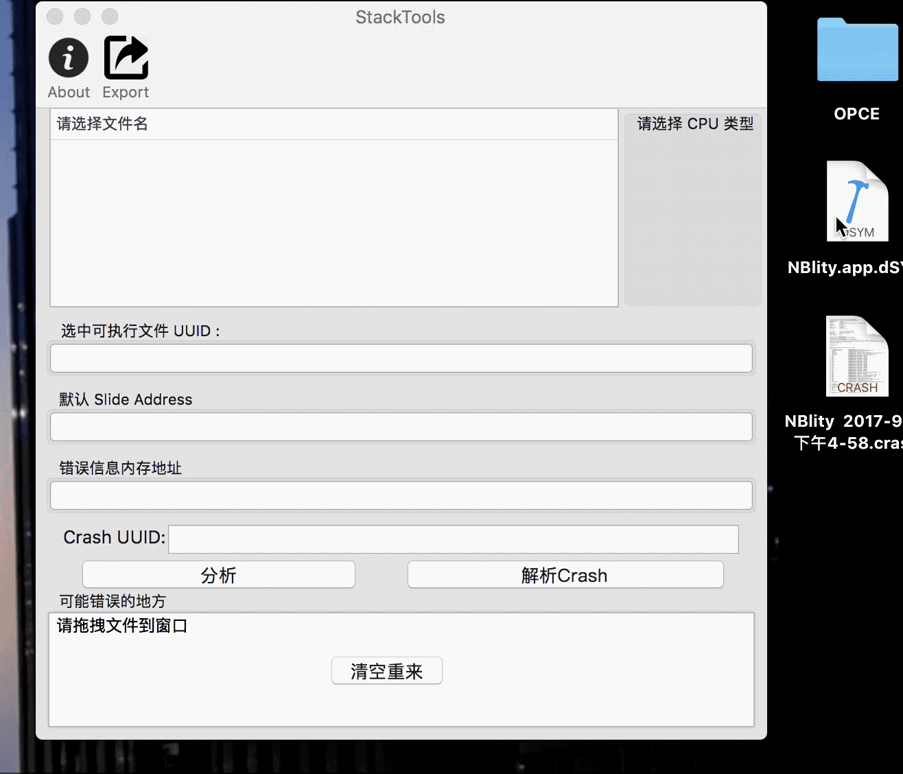

# StackTools
在DSYMTools的基础上,新增了解crash的功能,和填入初始偏移量

- 你可以点击该链接, 直接下载[StackTools.app](image/release/StackTools.app.zip)
- 或者在release分支下载
- 或者git url

通过对[DSYMTools](https://github.com/answer-huang/dSYMTools)源码解读,使用的是终端交互的语法,第一次写mac桌面版的APP才感受到Appkit和UIKit的diff
## 有一点必须承认, 没有太过细化代码和架构, 导致源码浏览不是很清晰, 
## 设计略笨拙, 由于时间紧张,我并没有太大优化, 只是加入了新的功能, 如果A君有任何想法,欢迎mail.

> 1 在原有基础上实现了拖入.crash文件,新增解析crash功能;
> 2 crash和dSYM解析的UUID匹配,保证是绝对成功的解析;
> 3 自动从crash文件导入初始偏移量,优化手动输入的功能

